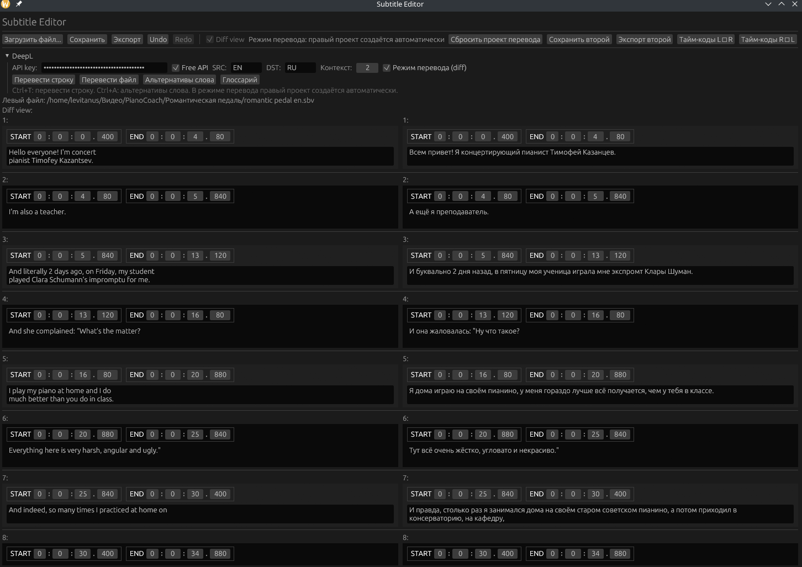

# Subtitle Editor

Subtitle Editor, made for making YouTuber life easier.

The Idea is of using YouTube autogenerated subtitles as a source, splitting them by lines and editing in the app, returning back to YouTube as lines massive for timecodes generation and translating to several languagens with integrated DeepL API (You need a personal API token for this).



## Features
- Import/export: txt, sbv, srt, seproj (JSON)
- Lines editing: subdivision and squashing with timecodes subdivision and squashing
- Diff view for aligning transcript with timecoded version or for translating
- drop-in transfering of timecodes from one file to another

## Shortcuts
- Ctrl+Z / Ctrl+Shitf+Z ‒ Undo/Redo
- Ctrl+Return ‒ Split line (Timecode duration will be splitted proportionally)
- Ctrl+Backspace ‒ Join with the previous line (Timecode will be summed)
- Ctrl+Del ‒ remove line
- Ctrl+N ‒ add line (default 3 sec length)
- Ctrl+T ‒ Translate the line (in translation mode)
- Ctrl+Shift+T ‒ Translate n lines (default 20)
- Ctrl+A ‒ Show Alternatives (in translation mode)

## Run
```bash
cargo run
```
